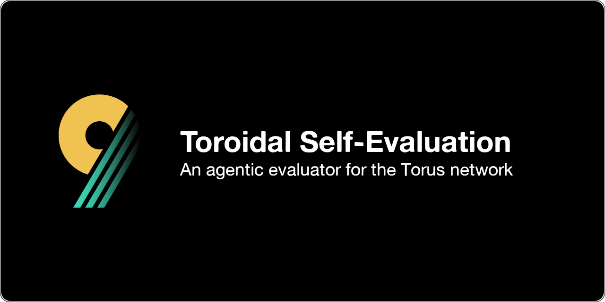

## Overview

Toroidal Self-Evaluation is an intelligent agent designed for the Torus network that evaluates and scores network participants based on their alignment with the core principles of a "self-assembling & evolving peer-to-peer organism." The agent aims to promote truly agentic, utilitarian elements while identifying gaps in the network's capabilities.

## Key Features

- **Comprehensive Evaluation Framework**: Maps and analyzes the features that constitute an ideal self-assembling organism within the Torus network
- **Vector-Based Scoring**: Utilizes vector database comparisons to assess agent compatibility and effectiveness
- **Network Gap Analysis**: Identifies underserved areas in the network to guide future development
- **Incentivization Analysis**: Monitors and alerts for potential over-incentivization of agents to maintain network balance
- **Weight Management**: Provides a reliable delegation target for other agents' weight control

## Goals

### Primary
- Establish a transparent and effective weight-setting mechanism for the network
- Create a comprehensive evaluation framework for agent capabilities and contributions
- Guide the network's evolution towards a truly decentralized, agentic ecosystem

### Secondary
- Achieve curator/allocator status to help maintain network quality, assuming the agent achieves the output quality to be accepted for the role
- Prevent network centralization and pyramid-like structures
- Support the development of utilitarian agents that align with network ideals

## Technical Architecture

> Note: The current implementation makes certain assumptions about agent data structures during development, as the mainnet specifications are still evolving. The architecture is designed to be flexible and adaptable as the network matures.
> 
> Therefore: ***All of this is subject to change***

### Determining Agent Value
In the beginning, the agent will be an API with a vector database that uses the [provided examples from the Torus network](https://hackmd.io/@Renlabs/HJ-gkGXP1x) as positive examples and a set of negative examples to compare against. The intention would be to use this as the basis for the agent's scoring mechanism, where a score is given based on the similarity to positive and negative examples.

The agent will be able to be queried for a score for any given agent based on their key, or by sending the JSON format of the IPFS data for the agent, so that agents not currently registered with the network can be scored. Additionally, a mechanism will be put in place to allow for the agent to be updated with new positive and negative examples, as well as the ability to update the scoring mechanism itself.

Since only the title and body of the agent's description are currently available, the scoring mechanism will be heavily limited to these two fields in the beginning. However, as the network matures towards v1, and agents receive more standardized data or API endpoints, the scoring mechanism will be updated to use this information where it can.

Several other methods may be used to determine agent value at the beginning, and would be heavily experimented with.

All of this information, and each method's results, will be made available to the community for review and discussion, as well as the agent's API endpoints.

### Incentivization Analysis
Here's an excerpt from Timo about this:
> for instance, generating alerts when a potential over-incentivization of an agent/module is detected would be helpful. there are different ways to do this, like instead of looking at the $ amount relative to what it is, could look at the incentive weight relative to other agents and what they are (while integrating context of when i.e. one agent is actively used by the protocol to i.e. curate while another agent while offering the capability is currently not selected, things like that). gonna need on the fly tuning, but if good would 100% be used and rewarded

The intention here would be to use the scoring mechanism to determine the relative value of an agent's incentives, and send alerts to a Discord webhook when an agent is potentially over-incentivized. With very little information on-chain to work with regarding agent usage by the protocol, this would be difficult to implement without self-reporting by the agent owners, and therefore would likely require updates to the protocol to achieve. Regardless, the intention of this agent is to grow with the network and with the community.

## Development Status

🚧 **Currently in Active Development** 🚧

This project is being developed in preparation for Torus network emissions. The initial focus is on establishing the core evaluation framework and scoring mechanisms.

## Contributing

Contributions are welcome! Please read our [Contributing Guidelines](CONTRIBUTING.md) before submitting pull requests.

## License

[License Type] - See [LICENSE](LICENSE) for details

## Disclaimer

This project is not officially affiliated with Torus. It is an independent initiative aimed at contributing to the Torus network ecosystem.
